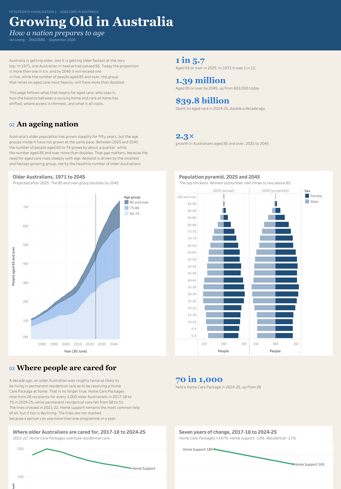

# Growing Old in Australia

A one-page interactive data story in Tableau on how Australia's ageing population turns into demand for aged care: how many Australians are old and which age groups are growing fastest, whether people are cared for in a nursing home or at home, how access differs between the cities and remote areas, what governments spend, and how the states compare. Twelve charts in six sections, written for a general reader with no statistical background.

**Live:** https://public.tableau.com/app/profile/ian.leong4002/viz/GrowingOldinAustralia/GrowingOldinAustralia

| | |
|---|---|
| **Author** | Ian Leong Zheng Yan |
| **Unit** | FIT3179 Data Visualisation, Monash University Malaysia, Data Visualisation 1 |
| **Period** | August to September 2026 |
| **Tool** | Tableau Public, with Python for data preparation |



## The story

One Australian in twelve was aged 65 or over in 1971. Today it is one in 5.7, and the 85-and-over group, which relies on aged care most, will more than double to 1.39 million by 2045. The page follows what that means in six sections:

| Section | Charts | Headline |
|---|---|---|
| An ageing nation | Stacked area of the 65+ population by age band, 1971 to 2045; population pyramid for 2025 and 2045 | The 85+ group grows 2.3 times by 2045 |
| Where people are cared for | Multi-line of recipients per 1,000 by programme; slope chart 2017-18 vs 2024-25 | Home Care Packages overtook residential care in 2021-22, rising from 28 to 70 per 1,000 |
| Who uses aged care | Heatmap of programme by age group; waffle chart of every 100 people aged 90+ | 414 in 1,000 aged 90+ used residential care, against 4 in 1,000 aged 65 to 69 |
| City and country gap | Sorted bars of places per 1,000 by remoteness; dot plot of occupancy against the national rate | Very remote areas have 10.5 places per 1,000 against 48 in the cities, and the lowest occupancy |
| Paying for it | Waterfall of the $19.5 billion increase; bars of 2024-25 spending by programme | Spending doubled in a decade; residential care still takes 64 cents in every dollar |
| State by state | Dumbbell of residential vs home care by state; bump chart ranking states on Home Care Packages | South Australia rose from sixth to first while both territories fell to the bottom |

## Data

Four datasets from three independent government sources, combined only as rates per 1,000 people aged 65 and over, because the aged-care counts cover a financial year while population is a 30 June estimate, so the two cannot be joined row by row. Spending is in constant 2024-25 dollars.

| Source | Dataset | Used for |
|---|---|---|
| Australian Bureau of Statistics | National, state and territory population, December 2025, Table 59 | Older population by age band; the denominator of every rate |
| Australian Bureau of Statistics | Population projections, Australia, 2022 (base) to 2071, Series B, Table B9 | The 2045 projections in the area chart and the pyramid |
| Productivity Commission | Report on Government Services 2026, Part F, Section 14, Aged care services | Recipients per 1,000 by programme, state and age group, 2017-18 to 2024-25; real government spending 2014-15 to 2024-25 |
| Australian Institute of Health and Welfare with the Department of Health, Disability and Ageing | Aged Care Data Snapshot 2025 (GEN Aged Care Data) | Residential places and occupancy by remoteness at 30 June 2025 |

The spreadsheets were downloaded, reshaped from wide to long form and cut into one tidy CSV per chart with a Python script, then loaded into Tableau as extracts. Full citations are printed at the foot of the dashboard.

## Design

The dashboard follows the Week 2 sketch (`docs/week2_sketch.jpg`) section for section. Design choices, in brief:

- **Idioms chosen for the question at each point.** An area chart shows total and share at once; the pyramid shows the thickening at the top; the slope chart strips a time series down to the change; the waffle turns a percentage into countable people; dots rather than bars for occupancy because the axis starts at 60% and a bar from 60 would exaggerate the gap; the bump chart is the only idiom that shows a rank moving over time.
- **Seven advanced idioms**: population pyramid, slope, heatmap, waffle, waterfall, dumbbell and bump charts.
- **One colour meaning everywhere**: blue is residential care, orange is Home Care Packages, green is home support, and age bands use a single blue ramp.
- **Interaction**: plain-language tooltips on every mark, and hovering a programme in one chart highlights it in every other chart that shows programmes.
- **Custom-built elements**: the bump chart's rank numbers, state names and year labels sit as text marks on a continuous axis so they never overlap, the dumbbell uses a dual axis, and every chart title sits in a block of equal height so paired charts start level. These were done by editing the workbook XML, since Tableau's menus do not offer them.
- **Writing for the average reader**: no abbreviations, programme names in full, one short paragraph and one headline number per section, and chart titles that state the finding.

## Repository layout

```
growing-old-in-australia/
├── workbook/
│   ├── Growing Old in Australia.twbx   packaged workbook with data extracts, opens in Tableau Public (free)
│   └── Growing Old in Australia.twb    the workbook XML, for reading and diffing
└── docs/
    ├── dashboard_full.png              the whole page
    ├── dashboard_1..3_*.png            the page in three parts
    ├── week2_sketch.jpg                the hand-drawn plan the dashboard follows
    ├── week2_sketch_submission.pdf
    └── DV1_writeup.pdf                 the What/Why/How write-up submitted with the visualisation
```

## Open it

Download and install [Tableau Public](https://www.tableau.com/products/public) (free), then open `workbook/Growing Old in Australia.twbx`. The data extracts are packaged inside it. Or just view it live at the link above.
