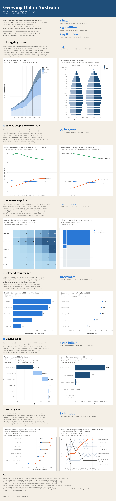

# Growing Old in Australia

FIT3179 Data Visualisation 1 (Monash University, 2026). A single-page Tableau dashboard about Australia's ageing population and the aged care system that supports it.

**Live dashboard:** https://public.tableau.com/app/profile/ian.leong4002/viz/GrowingOldinAustralia/GrowingOldinAustralia



## What is in the dashboard

- 12 charts in six sections, telling one story from population growth to service demand and spending
- 7 advanced idioms: population pyramid, heatmap, waffle chart, waterfall, dumbbell, bump chart and slope chart
- Fixed programme colours used across every chart (Residential, Home Care, Home Support, Respite, Transition)
- Highlight action on programme, tooltips on every chart and a callout figure beside each section
- Warm sand page, white chart cards and a navy header band

## Folder layout

| Path | Contents |
|---|---|
| `Growing Old in Australia.twbx` | Final packaged workbook (the published version) |
| `report/` | Submitted report PDF (Parts A to D) |
| `images/` | Full-page capture of the published dashboard and the Week 2 hand sketch |
| `data/raw/` | Original downloads from ABS, AIHW GEN and Productivity Commission ROGS 2026 |
| `data/out/` | Clean Tableau-ready CSVs used by the workbook |
| `data/DATA.md` | Provenance for every dataset and how each CSV was derived |
| `data/SOURCES.md` | Source URLs and citations |
| `scripts/data_pipeline/` | Python that turns `data/raw/` into `data/out/` |
| `scripts/tableau_build/` | Python that generates and polishes the workbook XML |

## Data sources

- Australian Bureau of Statistics, National, state and territory population (3101.0), estimated resident population by age
- Australian Bureau of Statistics, Population Projections, Australia (3222.0), medium series
- Australian Institute of Health and Welfare, GEN Aged Care Data Snapshot 2025
- Productivity Commission, Report on Government Services 2026, Part F Section 14 Aged care services

Full citations are in `data/SOURCES.md`.

## Rebuilding

Open `Growing Old in Australia.twbx` in Tableau Public or Tableau Desktop. Nothing else is needed to view or edit it.

To regenerate from scratch (Python 3 with pandas, openpyxl and tableauhyperapi):

```bash
# 1. raw downloads -> clean CSVs
python scripts/data_pipeline/build_datasets.py   # writes data/out/

# 2. clean CSVs -> finished workbook (run inside scripts/tableau_build)
cd scripts/tableau_build
python fix_v4.py      # layout, text columns, callouts, sources (reads v3/)
python fix_v5.py      # full-form labels, bump chart, title blocks
python fix_v6_bg.py   # sand page, white cards, navy header band
python wordcheck.py   # checks every text line stays within 15 words
```

The output lands in `scripts/tableau_build/out/`. `build_workbook.py` and `fix_v3_layout.py` are the earlier stages that produced the v3 base kept in `v3/`. `build_partb.py` fills the Word report template and `shot2.ps1` captures Tableau windows for checking. Both still point at local Windows paths.
